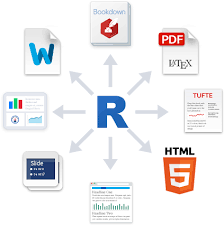

```{r setup, include=FALSE}
library(knitr)
## Text results
opts_chunk$set(echo = TRUE, warning = FALSE, message = FALSE, cache = TRUE)

## Code decoration
opts_chunk$set(tidy = FALSE, comment = NA, highlight = TRUE, size = "footnotesize")

```


## Why R

- Free, open-source, cross-platform

- Not just stats package, but a programming language

- Can do many things beyond stats (e.g. scrape web data, GIS, etc)

- +15,000 packages extending functionality

- Flexible, powerful

- Can easily connect to other languages (e.g. Python, C++)

- High-quality graphics

- Large, helpful community (forums, StackOverflow, Twitter)


# Some cool things you can do with R (besides cutting-edge stats)


## Where is Rio de Janeiro?

```{r echo=FALSE}
library(tmap)
data("World")
```


```{r}
library(tmaptools)
rio <- geocode_OSM("Rio de Janeiro", as.sf = TRUE)
library(ggplot2)
ggplot() +
  geom_sf(data = World) +
  geom_sf(data = rio, size = 4)
```


## How was air quality in Sevilla?

```{r echo=c(-3)}
library(aire)
air.se <- get_daily_data("2016-12-10", province = "se")
air.se$O3 <- as.numeric(air.se$O3)
library(openair)
timePlot(air.se, pollutant = "O3", type = "site")
```


## Get climate data from the web

```{r}
library(meteoForecast)
tiempo <- getRaster("temp", day = "2016-11-25")
library(rasterVis)
levelplot(tiempo, layers = 10:13)
```


## Create websites, slides, articles, thesis

```{r echo=FALSE}

```


## Download data from World Bank and display motion chart

```{r eval=FALSE}
library(googleVis)
demo(WorldBank)
```


# and many more...


