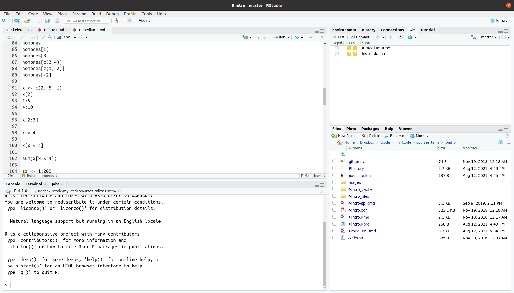

```{r setup, include=FALSE}
options(htmltools.dir.version = FALSE)

library(knitr)
knit_hooks$set(crop = hook_pdfcrop)
opts_chunk$set(echo = TRUE, message = FALSE, warning = FALSE, 
               crop = TRUE, cache = TRUE, comment = "")

opts_chunk$set(out.width = "70%", fig.align = "center")
```


```{css, echo=FALSE}

.remark-slide-number {
  display: none;
}

# .remark-slide-content {
#   font-size: 18px;
#   padding: 20px 80px 20px 80px;
# }

.remark-slide-content p, ul, ol, li {
  font-size: 18px;
}


.remark-code, .remark-inline-code {
  background: #f0f0f0;
}

.remark-code {
  font-size: 18px;
}

.hugecode .remark-code { font-size: 200% }
.largecode .remark-code { font-size: 130% }
.smallcode .remark-code{ font-size: 70% }
.tinycode .remark-code { font-size: 50% }

.huge { font-size: 200% }
.large { font-size: 130% }
.small { font-size: 70% }
.tiny { font-size: 50% }

```


## RStudio

https://rstudio.com

```{r echo=FALSE, out.width="70%"}

```


---

## RStudio projects

https://r4ds.had.co.nz/workflow-projects.html

```{r echo=FALSE, out.width="50%"}
include_graphics("images/projects_new.png")
```


---

## R as calculator

```{r}
4 + 8
```

```{r}
20 * 3
```


---

## R as calculator

```{r}
log(4)
```

```{r}
sqrt(50)
```


---

## Getting help about functions

```{r}
?log
?sqrt
```


---

## Assignment

```{r}
x <- 3
x
```


---

## Assignment

```{r}
x <- 3
x
log.x <- log(x)
log.x
```


---

## Assignment

```{r}
y <- c(1, 2, 5, 12)
log(y)
log.y <- log(y)
```


---

## Vectors

```{r error=TRUE}
students <- c("Maria", "Pedro", "Pablo", "Alicia")
sum(students)
```


---

## Vectors

```{r}
students <- c("Maria", "Pedro", "Pablo", "Alicia")
length(students)
```


---

## Vectors

```{r}
values <- c(4, 3, 1)
sum(values)
```


---

## Indexing

```{r}
students <- c("Maria", "Pedro", "Pablo", "Alicia")
students[1]
students[3]
students[c(3,4)]
students[-2]
```


---

## Indexing & subsetting

```{r}
x <- c(2, 5, 1)
x > 4
which(x > 4)
```


---

## NA: Not Available / Missing Values

```{r}
ages <- c(8, 31, 14, NA, 35, NA)
ages > 30
```


---

## NA: Not Available / Missing Values

```{r}
ages <- c(8, 31, 14, NA, 35, NA)
ages == 20
ages == 31
ages == 31 | ages == 35
```


---

## Calling functions

```{r}
ages <- c(8, 31, 14, NA, 35, NA)
sum(ages)
?sum
sum(ages, na.rm = TRUE)
mean(ages, na.rm = TRUE)
```


---

## Getting help


- ?function

- Search online: r whatever

- [Cheatsheets](https://www.rstudio.com/resources/cheatsheets/)

- Plenty of online tutorials, books, etc ([e.g.](https://education.rstudio.com/))


---

## Your turn

Having this vector of values
```{r}
x <- c(2, 4, 6, 8, 10, NA)
```

- select the 2nd element

- get the sum of all values in x

- create new object (y) with all values from x > 5


---

## END


Slides and source code available at https://github.com/Pakillo


