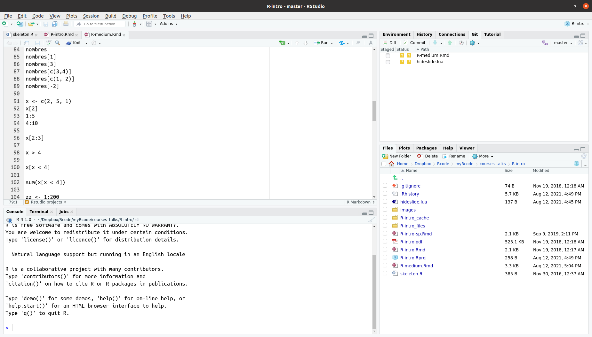
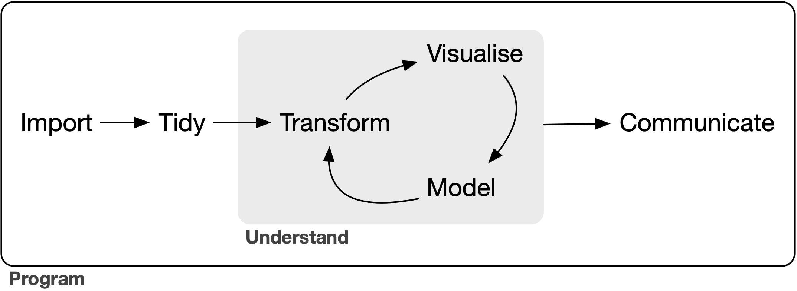

```{r knitr_setup, include=FALSE, cache=FALSE}

library("knitr")

### Chunk options ###

## Text results
opts_chunk$set(echo = TRUE, warning = FALSE, message = FALSE, size = 'tiny')

## Code decoration
opts_chunk$set(tidy = FALSE, comment = NA, highlight = TRUE, prompt = FALSE, crop = TRUE)

# ## Cache
# opts_chunk$set(cache = TRUE, cache.path = "knitr_output/cache/")

# ## Plots
# opts_chunk$set(fig.path = "knitr_output/figures/")
opts_chunk$set(fig.align = 'center', out.width = '90%')

### Hooks ###
## Crop plot margins
knit_hooks$set(crop = hook_pdfcrop)

## Reduce font size
## use tinycode = TRUE as chunk option to reduce code font size
# see http://stackoverflow.com/a/39961605
knit_hooks$set(tinycode = function(before, options, envir) {
  if (before) return(paste0("\n \\", options$size, "\n\n"))
  else return("\n\n \\normalsize \n")
  })

```


## Why R

- Free, open-source, cross-platform

- Not just stats package, but a programming language

- Can do many things beyond stats (scrape web data, GIS, etc)

- +18,000 packages extending functionality

- Flexible, powerful

- Can easily connect to other languages (e.g. Python, C++)

- High-quality graphics

- Large, helpful community (forums, StackOverflow, Twitter, Slack)


## RStudio

https://rstudio.com

```{r echo=FALSE}

```


## RStudio projects

https://r4ds.had.co.nz/workflow-projects.html

```{r echo=FALSE}
include_graphics("images/projects_new.png")
```


## Getting help

- ?function

- Search online: r whatever

- [Cheatsheets](https://www.rstudio.com/resources/cheatsheets/)

- Plenty of online tutorials, books, etc ([e.g.](https://education.rstudio.com/))


## Packages

Install package (only once):

```{r echo = TRUE, eval = FALSE}
install.packages("visreg")
```


Load package (once per session):

```{r echo = TRUE, eval = FALSE}
library("visreg")
```


## The tidyverse

```{r echo=FALSE}

```


## Reading in data

Base R:

```{r}
trees <- read.csv("trees.csv")
```

Tidyverse:

```{r}
library("tidyverse")

trees <- read_csv("trees.csv")
```


## Data frames 

\footnotesize

```{r}
head(trees)
```


## Data frames 

\footnotesize

```{r}
summary(trees)
```

## Create new variable (base R)

```{r}
trees$height.cm <- trees$height * 100
```

## Modify existing variable (base R)

```{r}
trees$dead <- as.factor(trees$dead)
```


# Data manipulation with dplyr

---

```{r}
library("dplyr")
```


## Rename variables

```{r}
trees <- trees %>% 
  rename(diam = dbh)
```

## Filter cases

Select only alive trees

```{r}
alive <- trees %>% 
  filter(dead == 0)
```

```{r}
alive <- trees %>% 
  filter(dead < 1)
```


## Filter cases

Select only dead trees

```{r}
dead <- trees %>% 
  filter(dead == 1)
```

```{r}
dead <- trees %>% 
  filter(dead > 0)
```


## Filter cases

Select only trees with diameter > 10 cm

```{r}
trees.big <- trees %>% 
  filter(diam > 10)
```


## Filter cases

Select only alive trees with diameter > 10 cm

```{r}
trees.big.alive <- trees %>% 
  filter(diam > 10, dead == 0)
```


## Select columns

```{r}
trees.height <- trees %>% 
  select(height)
```


## Remove columns

```{r}
trees2 <- trees %>% 
  select(-sex)
```


## Modify/Create columns

```{r}
trees <- trees %>% 
  mutate(height.cm = height * 100)
```


## Modify/Create columns

```{r}
trees <- trees %>% 
  mutate(alive = ifelse(dead == 0, "yes", "no"),
         height.cm = height*100)
```


## Summarise data

```{r}
mean.height.site <- trees %>%
  group_by(site) %>%
  summarise(mean(height))
```


# Data visualisation

## Base R `plot`

```{r}
plot(trees$diam, trees$height)
```


## ggplot

\footnotesize

```{r out.width="50%"}
library("ggplot2")
ggplot(trees) + 
  aes(x = diam, y = height) +
  geom_point() +
  geom_smooth(colour = "blue")
```

https://ggplot2.tidyverse.org/

